# 📍 APP BuscaCEP — Consulta Rápida de Endereços

## 🎯 Objetivo

Facilitar a consulta de endereços a partir de um CEP, resolvendo o problema de quem precisa obter rapidamente informações como **logradouro, bairro, cidade e UF**, sem depender de buscas manuais demoradas.

---

## 📷 Capturas de Tela 

## ✨ Funcionalidades

- 🔍 **Busca instantânea** de endereço pelo CEP  
- 📌 Retorna **logradouro, bairro, cidade e UF**  
- ⚡ **Consulta via API ViaCEP** (gratuita)  
- 📱 **Design responsivo** e fácil de usar  

## Tecnologias

  <figure style="display:inline-block; text-align:center; margin: 10px;">
    
    <figcaption>HTML5</figcaption>
  </figure>
  <figure style="display:inline-block; text-align:center; margin: 10px;">
    
    <figcaption>CSS3</figcaption>
  </figure>
  <figure style="display:inline-block; text-align:center; margin: 10px;">
    
    <figcaption>JavaScript</figcaption>
  </figure>
  <figure style="display:inline-block; text-align:center; margin: 10px;">
    
    <figcaption>API de CEP</figcaption>
  </figure>

